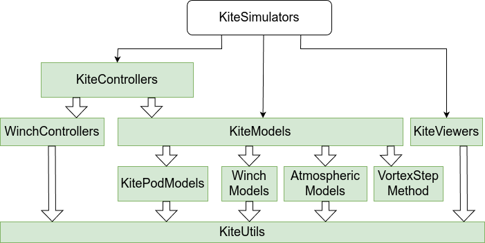

# WinchControllers

[](https://opensourceawe.github.io/WinchControllers.jl/dev)
[](https://github.com/opensourceawe/WinchControllers.jl/actions/workflows/CI.yml?query=branch%3Amain)
[](https://codecov.io/gh/opensourceawe/WinchControllers.jl)

Discrete controllers for Winches.

This package is part of Julia Kite Power Tools, which consists of the following packages:
<p align="center"></p>

## Installation
<details>
  <summary>Installation of Julia</summary>

If you do not have Julia installed yet, please read [Installation](https://github.com/aenarete/KiteSimulators.jl/blob/main/docs/Installation.md).

</details>

<details>
  <summary>Installation as package</summary>

### Installation of WinchControllers as package

It is suggested to use a local Julia environment. You can create it with:
```bash
mkdir myproject
cd myproject
julia --project=.
```
(don't forget typing the dot at the end), and then, on the Julia prompt enter:
```julia
using Pkg
pkg"add WinchControllers#main"
```
You can run the tests with:
```julia
using Pkg
pkg"test WinchControllers"
```
To add the examples and install the packages needed by the examples, run:
```julia
using WinchControllers
WinchControllers.install_examples()
exit()
```
</details>

<details>
  <summary>Installation using git</summary>

### Installation of WinchControllers using git

In most cases -- if you want to modify, tune and understand kite controllers -- it is better
to check out this project from git. You can do this with:
```bash
git clone https://github.com/aenarete/WinchControllers.jl.git
cd WinchControllers.jl
git checkout v0.1.0
```
For the checkout command, use the tag of the latest version.
</details>

## This package provides
### Utility functions
```
saturate(value, min_, max_)
```
Calculate a saturated value, that stays within the given limits.
```
wrap2pi(angle)
```
Convert an angle, given in radians in an infinite range to the range from -pi to pi

### Generic control components
This package contains some generic control components that are documented [here](./docs/components.md).

### Types that are not generic
```julia
CalcVSetIn              # component that calculates the set speed using soft switching
SpeedController         # controller for normal operation
LowerForceController    # controller when force near lower limit
UpperForceController    # controller when force near upper limit
WinchController         # winch controller, combining the three controllers above
WCSettings              # settings of the winch controller
WinchModel              # simplified model for unit testing
```

## Winch controller
For a kite power system, the reel-out speed of the winch must be controlled such that the
maximal tether force is never exceeded, while the reel-out speed should be optimized for
maximal power over the full cycle at wind speeds below rated wind speed. To keep the
kite controllable, also a minimal tether force limit has to be kept. Depending on the mode of operation, one of the following three controllers is used:
### Speed Controller
<p align="center"></p>

### Lower Force Controller
<p align="center"></p>

### Upper Force Controller
<p align="center"></p>

### WinchController - Usage -
The WinchController combines the three controllers, mentioned above.
It can be operated in two modes of operation:
- position control
- power production

In position control mode it requires a set speed as input. Upper and lower force limits
are respected.
In power production mode it does not require any input but the measured tether force.
Output is the set speed of the asynchronous motor.

For a usage example look at the script [test_winchcontroller.jl](./test/test_winchcontroller.jl) .

## Licence
This project is licensed under the MIT License. Please see the below WAIVER in association with the license.

## WAIVER
Technische Universiteit Delft hereby disclaims all copyright interest in the package “KiteController.jl” (controllers for airborne wind energy systems) written by the Author(s).

Prof.dr. H.G.C. (Henri) Werij, Dean of Aerospace Engineering

## Scientific background
[A Methodology for the Design of Kite-Power Control Systems](https://research.tudelft.nl/en/publications/a-methodology-for-the-design-of-kite-power-control-systems)

## Donations
If you like this software, please consider donating to https://gofund.me/508e041b .

## Related
- [Research Fechner](https://research.tudelft.nl/en/publications/?search=wind+Fechner&pageSize=50&ordering=rating&descending=true) for the scientific background of this code
- The meta package [KiteSimulators](https://github.com/aenarete/KiteSimulators.jl) which contains all packages from Julia Kite Power Tools.
- the packages [KiteModels](https://github.com/ufechner7/KiteModels.jl) and [WinchModels](https://github.com/aenarete/WinchModels.jl) and [AtmosphericModels](https://github.com/aenarete/AtmosphericModels.jl)
- the packages [KiteViewers](https://github.com/aenarete/KiteViewers.jl) and [KiteUtils](https://github.com/ufechner7/KiteUtils.jl)