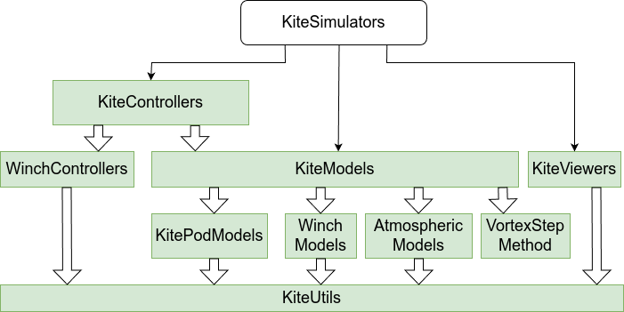

```@meta
CurrentModule = WinchControllers
```

# WinchControllers
Documentation for the package [WinchControllers](https://github.com/aenarete/WinchControllers.jl).

This package is part of Julia Kite Power Tools, which consist of the following packages:



## Installation
Install [Julia 1.10](https://ufechner7.github.io/2024/08/09/installing-julia-with-juliaup.html) or later, if you haven't already. On Linux, make sure that Python3 and Matplotlib are installed:
```
sudo apt install python3-matplotlib
```
Before installing this software it is suggested to create a new project, for example like this:
```bash
mkdir test
cd test
julia --project="."
```
Then add WinchControllers from  Julia's package manager, by typing:
```julia
using Pkg
pkg"add WinchControllers"
``` 
at the Julia prompt. You can run the unit tests with the command (careful, can take 60 min):
```julia
pkg"test WinchControllers"
```

## Provides

## See also
- [Research Fechner](https://research.tudelft.nl/en/publications/?search=Fechner+wind&pageSize=50&ordering=rating&descending=true) for the scientic background of this code
- The meta-package  [KiteSimulators](https://github.com/aenarete/KiteSimulators.jl)
- the package [KiteUtils](https://github.com/ufechner7/KiteUtils.jl)
- the packages [WinchModels](https://github.com/aenarete/WinchModels.jl) and [KitePodModels](https://github.com/aenarete/KitePodModels.jl) and [AtmosphericModels](https://github.com/aenarete/AtmosphericModels.jl)
- the packages [KiteControllers](https://github.com/aenarete/KiteControllers.jl) and [KiteViewers](https://github.com/aenarete/KiteViewers.jl)

Author: Uwe Fechner (uwe.fechner.msc@gmail.com)
