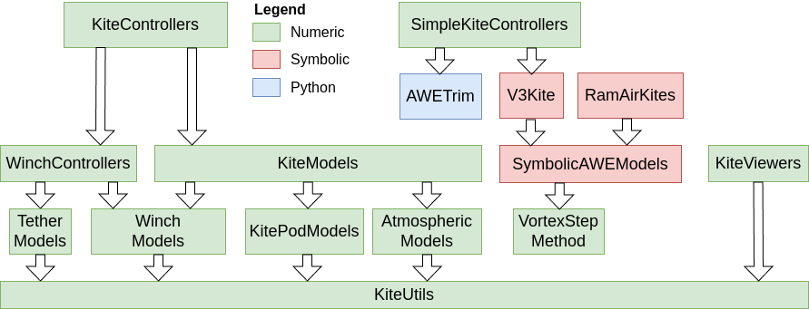

```@meta
CurrentModule = WinchControllers
```

# WinchControllers
Documentation for the package [WinchControllers](https://github.com/OpenSourceAWE/WinchControllers.jl).

This package is part of Julia Kite Power Tools, which consists of the following packages:



## Goals of this package
The goal of this package is to provide controllers for winches that consist of a motor/generator connected to a drum (with or without gearbox). On the drum is a tether that is connected to a load or a kite. Currently operation in air is assumed, but the package could also be extended for winches connected to under-water cables. While the main use case of the author are airborne wind energy systems, I am open to add features needed for other use cases.

**Implemented features:**
- lower force control (assure that there is always a minimal cable tension)
- upper force control (keep the maximal force limited)
- reel-out speed control proportional to the square root of the force (other relationships can easily be added),
  either piecewise between the force limits or as a pure `kv * sqrt(force)` law (`WCSettings.mode = "reelout"`)
- control of asynchronous motors/ generators
- speed control
- auto-tuning of the controller
- disk based stability analysis of linearized system including the force controllers
- torque controlled winches, holding either a length ([`WinchPosController`](@ref)) or a force
  ([`WinchForceController`](@ref)); the length controller has an optional acceleration feed-forward
  (`WCSettings.winch_acc_ff`)
- soft force limiting for REEL_OUT mode, a continuous alternative to the upper/lower force controllers
  ([`calc_vro_soft`](@ref), settings `force_limit` and `soft_lfc`): a smoothly saturated inverse of the tension
  curve, a reel-in line below `f_low`, an optional low-pass filter of the measured force and an optional soft
  clamp at the maximal reel-out speed

**Planned features**
- improved, simplified system model using a quasi-steady tether model and an aerodynamic model including kite mass the cross-wind factor

## Installation
Install [Julia 1.10](https://ufechner7.github.io/2024/08/09/installing-julia-with-juliaup.html) or later, if you haven't already.
Before installing this software it is suggested to create a new project, for example like this:
```bash
mkdir test
cd test
julia --project="."
```
Then add WinchControllers from  Julia's package manager, by typing:
```julia
using Pkg
pkg"add WinchControllers"
``` 
at the Julia prompt. You can run the unit tests with the command:
```julia
pkg"test WinchControllers"
```
To add the examples and install the packages needed by the examples, run:
```julia
using WinchControllers
WinchControllers.install_examples()
exit()
```

### Installation using git
If you want to modify, tune and understand the controllers, it is better to check out this project from git:
```bash
git clone https://github.com/OpenSourceAWE/WinchControllers.jl.git
cd WinchControllers.jl
git checkout v0.6.2
bin/install
```
For the checkout command, use the tag of the latest version. The installation script asks which Julia version
to use (1.11, 1.12 or 1.13), installs the matching default manifest, instantiates and precompiles the main,
examples, test and docs projects and, on Julia 1.12 and 1.13, also runs the tests.

## Running the examples
To run the examples, launch Julia with:
```bash
bin/run_julia
```
and then, in the Julia REPL, type:
```julia
menu()
```
Alternatively, launch Julia with `julia --project` and type `include("examples/menu.jl")`.
You should now see a terminal menu with some examples. Select one using the
`<CURSOR UP>` and `<CURSOR DOWN>` keys, and press `<ENTER>` to run the selected example.

## Provides
- a set of generic control components, see [Generic Components](@ref)
- a winch controller [WinchController](@ref), that limits the upper and lower force and controls the speed as function of the force
- a winch controller settings struct [`WCSettings`](@ref) for the settings
- [Torque Controllers](@ref), [`WinchPosController`](@ref) and [`WinchForceController`](@ref), for winches driven by a torque command instead of a speed command
- [Utility Functions and Macros](@ref)

## See also
- [Research Fechner](https://research.tudelft.nl/en/publications/?search=Fechner+wind&pageSize=50&ordering=rating&descending=true) for the scientific background of this code
- The meta-package  [KiteSimulators](https://github.com/aenarete/KiteSimulators.jl)
- the package [KiteUtils](https://github.com/ufechner7/KiteUtils.jl)
- the packages [WinchModels](https://github.com/aenarete/WinchModels.jl) and [KitePodModels](https://github.com/aenarete/KitePodModels.jl) and [AtmosphericModels](https://github.com/aenarete/AtmosphericModels.jl)
- the packages [KiteControllers](https://github.com/aenarete/KiteControllers.jl) and [KiteViewers](https://github.com/aenarete/KiteViewers.jl)
- the package [SimpleKiteControllers](https://github.com/OpenSourceAWE/SimpleKiteControllers.jl), which uses the soft force
  limiting and the torque controllers of this package to fly a single line kite

Author: Uwe Fechner (uwe.fechner.msc@gmail.com)
