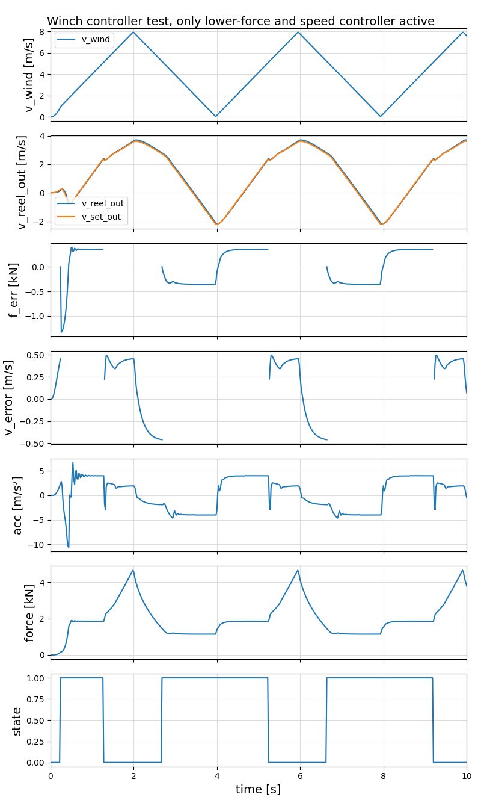

```@meta
CurrentModule = WinchControllers
```

# Tests
All tests can be executed using the command:
```
include("examples/menu.jl")
```
Most of these tests are not yet unit tests.

## Requirements
1. the force must never be below zero.
2. the max force shall not be above the nominal force of the winch, in this case 4000 N.
3. the absolute value of the acceleration must never accede `max_acc`.
3. the oscillations after switching the active controller shall be low.
4. the mean of the square of the force error shall be low
5. the mean of the square of the speed error shall be low
6. the robustness for model errors (for example with respect to the inertia of the drum and the drum diameter) 
   shall be high

Open question: can all these requirements be combined in two or three performance figures, for
example **efficiency**, **robustness** and **damage**?

**TODO**
- add `max_acc` the section `winch` of of `Settings.yaml`

## SpeedController

### SpeedController1
This test assumes a wind speed that starts at zero and reaches its nominal value after 0.25s. The nominal
value is a triangle signal between 4 and 8 m/s and a period time of 4s. The tether direction is aligned with the 
wind direction, the set value for the reel-out speed is 4 m/s. This means when the nominal reel-out speed is reached,
the apparent wind speed is between zero and 4 m/s. The force is proportional to the square of $v_a$.


### SpeedController2
This test is similar to the last test, but the set speed is calculated according to 
$v_{ro} = \sqrt{f} * kv$ , 
where $f$ is the measured tether force and $kv$ is a constant that needs to be optimized for a given kite power system. This should allow optimal energy harvesting during reel-out.


## ForceSpeedController
### ForceSpeedController1
This controller tests the combination of the lower force controller with the speed controller for the reel-out phase,
where the reel-out speed shall be proportional to the square-root of the force. The lower force limit was set to
$1500~N$.



### ForceSpeedController2
This controller tests all controllers. The lower force limit was set to $350~N$, the upper force limit to $3800~N$.


**State**

`0.` lower force controller active; `1.` speed controller active;  `2.` upper force controller active  

## Ideas
- add torque controlled winch (which will require a modified controller)
- add static tether model
- linearize the winch+tether models
- create bode plots
- analyze the stability
- add auto-tuning script
